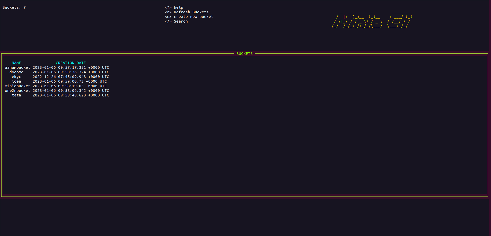
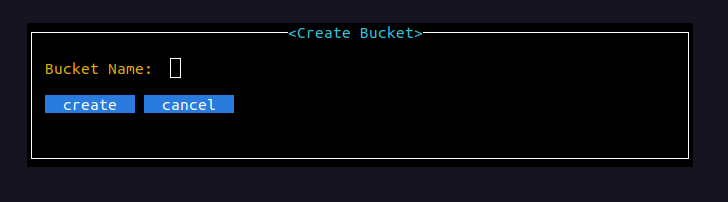
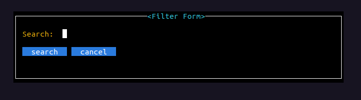
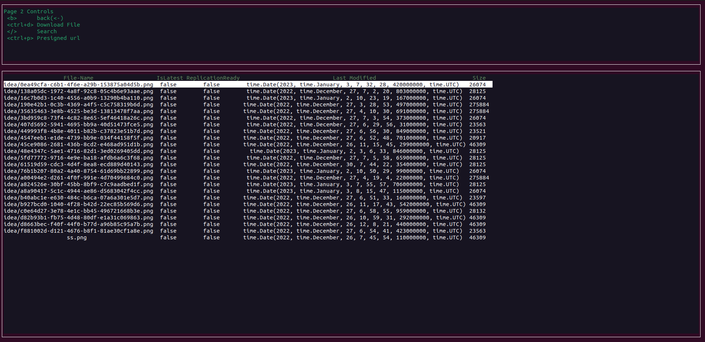
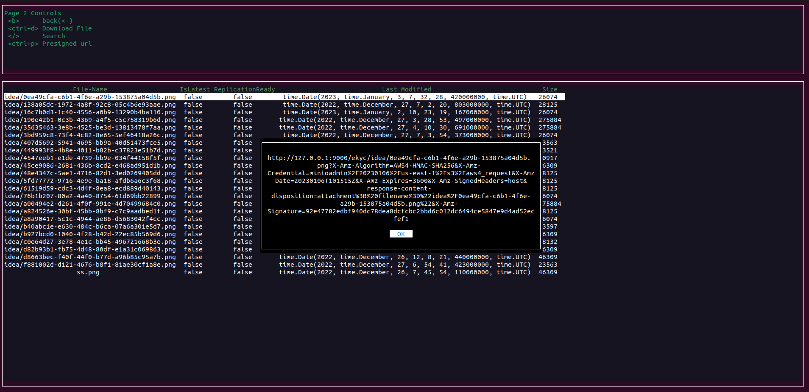
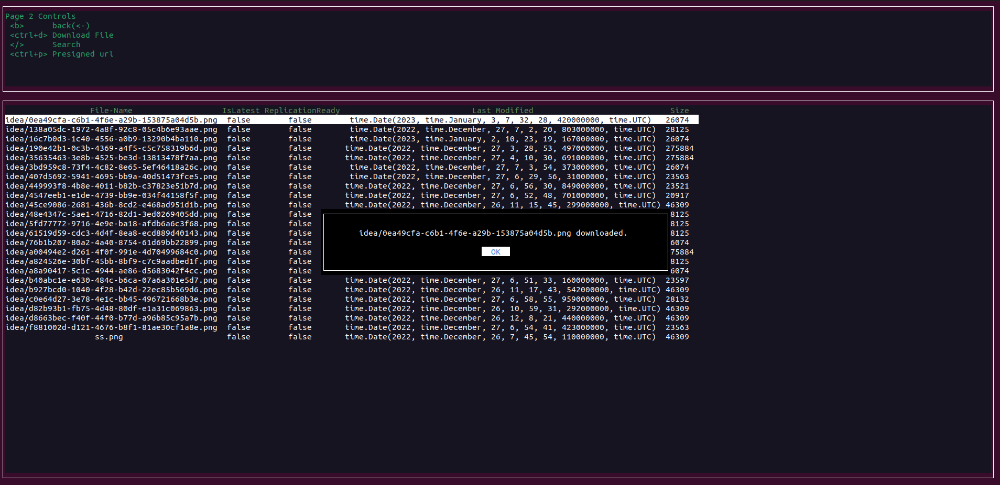

# minio-tui

----
Minio-tui is a terminal-based user interface that allows you to manage your buckets and perform various operations directly from the command line. With its wide range of commands, Minio-tui can save your time by eliminating the need to visit the Minio console to perform these tasks.

----

## To start using minio-tui

```
git clone https://github.com/one2nc/minio-tui
cd minio-tui
go run .
```

## Description

- The Minio-tui dashboard provides an overview of all your buckets, including the total number of buckets you have.
- You can refresh the bucket list by pressing the `r` key.
- To create a new bucket, use the key ` c `.   - - Navigation through the Minio-tui interface is easy, simply use the up and down arrow keys to move between options and press ` enter ` to select an option.
- You can get the presigned url of an object by pressing ` ctrl+p ` and download an object using ` ctrl+d `, that will save the file to the ` ./resources/images ` folder.


`minio-tui`



`Create Bucket` : Press `c`



`SearchBucket` : Press `/`



`View Obejct ` : Press `enter` on any bucket



`Presigned URL` : Press `ctrl+p`



`Download Object` : Press `ctrl+d`


